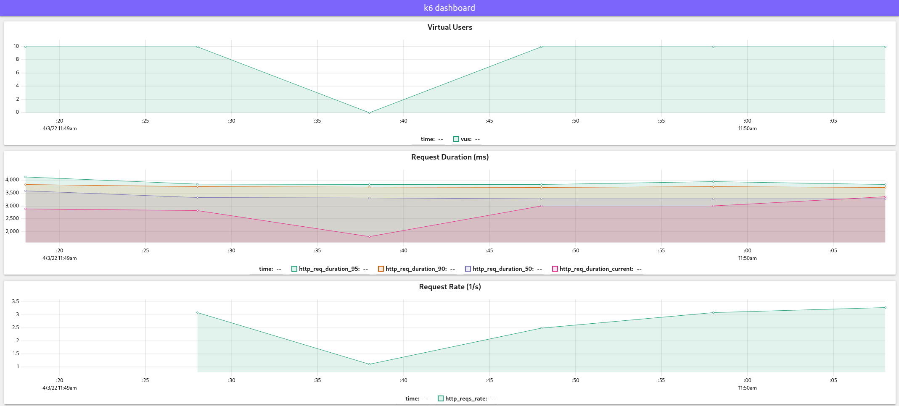

# Load test results

## Without database indexes

### 10 concurrent connection

### 100 concurrent connection

### 1000 concurrent connection

## With database indexes

### 10 concurrent connection

### 100 concurrent connection

### 1000 concurrent connection

### 1000 concurrent connection with new optimized mysql driver

